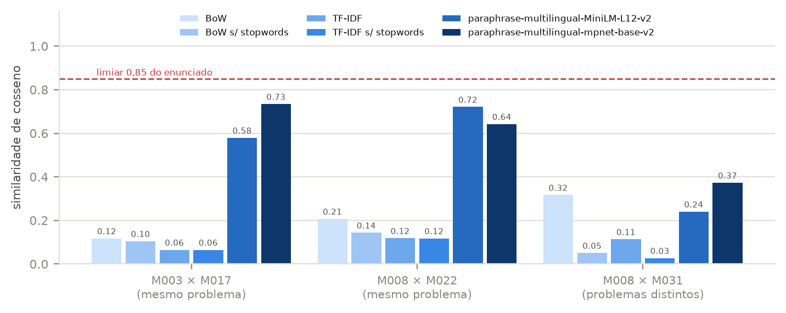
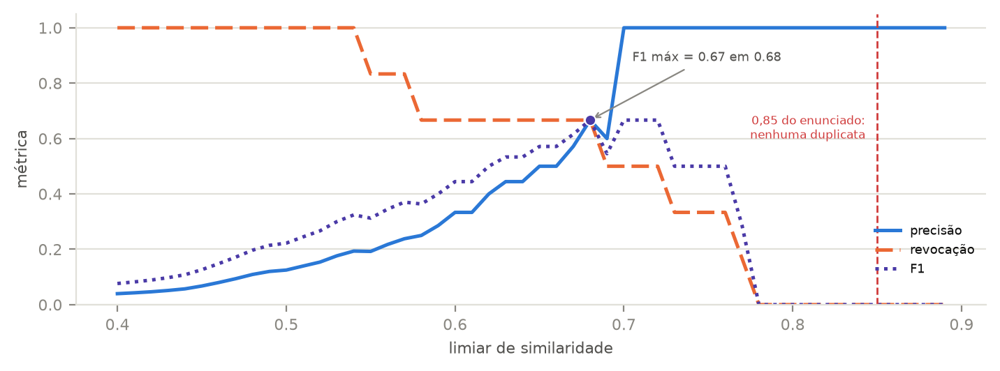

# Ouvidoria Municipal — Busca Semântica de Manifestações

**Relatório síntese** · Processamento de Linguagem Natural — representações vetoriais, busca semântica e chunking

> Aluno(a): `________________________` · Disciplina: `________________________` · Data: `____/____/______`

---

## 1. Escopo e organização

O trabalho constrói um sistema de apoio à triagem de manifestações de uma ouvidoria
municipal: dado um corpus de 40 manifestações em cinco categorias oficiais, o sistema
precisa (a) encontrar manifestações semanticamente parecidas com uma descrição livre do
cidadão, (b) apontar duplicatas — o mesmo problema relatado duas vezes com palavras
diferentes — e (c) lidar com relatos longos, que misturam vários problemas num só texto.

| Arquivo | Conteúdo |
|---|---|
| `análise_comparativa.ipynb` | Entrega 1 — BoW × TF-IDF × embeddings nos três pares do enunciado |
| `deteccao_duplicatas.ipynb` | Entrega 2 — `detectar_duplicatas()`, calibração do limiar, análise de erros |
| `chunking_manifestacoes.ipynb` | Entrega 3 — `RecursiveCharacterTextSplitter`, overlap, projeções 2D |
| `app_ouvidoria.py` | Entrega 4 — aplicação Streamlit com as quatro abas |
| `utils_ouvidoria.py` | Carga do corpus, registro de modelos, paleta — compartilhado |
| `data/manifestacoes.csv` | O corpus (40 manifestações) |
| `data/gabarito_duplicatas.csv` | Anotação manual dos pares duplicados e quase-duplicados |
| `data/gerar_dataset.py` | Script que gera o corpus e valida suas restrições |

Execução: `pip install -r requirements.txt` e depois `streamlit run app_ouvidoria.py`.
Os notebooks estão com todas as saídas já executadas.

---

## 2. Decisões de projeto

**2.1 Corpus sintético, com armadilhas deliberadas.** O corpus foi gerado por
`data/gerar_dataset.py`, que valida por asserção as restrições do enunciado: 40
manifestações, 8 por categoria, textos entre 50 e 800 caracteres, 5 relatos acima de 500
caracteres e 6 duplicatas semânticas (15%). Além disso, foram incluídos quatro pares
**quase-duplicados** — mesmo tipo de problema em **locais diferentes**, como "poste
apagado na Rua das Acácias" × "lâmpada queimada na praça do bairro Aparecida". Sem eles a
detecção de duplicatas seria trivial e a análise de falsos positivos, vazia; com eles, o
problema fica realista, porque é exatamente esse par que um sistema real erra.

**2.2 Modelos de embedding.** O enunciado sugere `BAAI/bge-small-pt-v1.5`, mas esse
repositório **não existe no HuggingFace Hub** (retorna 404). No lugar dele foi adotado o
`paraphrase-multilingual-MiniLM-L12-v2`, usado como padrão em todos os resultados deste
relatório. O registro em `utils_ouvidoria.py` mantém quatro
modelos, todos selecionáveis na barra lateral do app: `MiniLM-L12-v2` (padrão, leve),
`mpnet-base-v2` (maior e mais preciso), `distiluse-base-multilingual-cased-v1` e
`multilingual-e5-small` — este último exige o prefixo `query:` nos textos, aplicado
automaticamente pelo código.

**2.3 O limiar pertence ao modelo, não ao problema.** A decisão mais consequente do
trabalho. Em vez de fixar 0,85 no código, o limiar é calibrado contra o gabarito para cada
modelo, e o app troca o limiar junto com o seletor de modelo.

**2.4 Chunking.** Duas estratégias de separadores foram comparadas: a padrão do LangChain
(`["\n\n", "\n", " ", ""]`, que corta no meio da frase em textos corridos) e uma
consciente de frases (ponto, ponto-e-vírgula, vírgula). A configuração recomendada é
`chunk_size` 300 com `chunk_overlap` 90 — pelos motivos da seção 3.3, que não são os que
esperávamos no início.

**2.5 Visualização.** A paleta das cinco categorias foi verificada quanto a contraste e
separação para daltonismo; como a separação fica na faixa que exige reforço, **todo
gráfico de dispersão codifica a categoria pela cor e também pelo formato do marcador**,
nunca só pela cor. Os mapas de calor de similaridade usam rampa sequencial de um único
tom, e não arco-íris, porque codificam magnitude.

---

## 3. Resultados

### 3.1 Entrega 1 — as representações esparsas falham no caso central

O resultado mais expressivo não é que os embeddings sejam melhores — é **como** as
representações esparsas erram. Em BoW, o par `M008` × `M031`, que trata de assuntos
completamente diferentes (falta de médico × lâmpada queimada), marca **0,32**, quase três
vezes o valor de **0,12** do par `M003` × `M017`, que relata o mesmo buraco na mesma
avenida. A ordem está invertida: um sistema baseado em BoW agruparia "falta de médico" com
"lâmpada queimada" antes de agrupar duas denúncias do mesmo buraco.

A causa fica clara ao listar os termos em comum: `M003` e `M017` compartilham apenas *da,
equipe, está, nenhuma*, enquanto `M008` e `M031` compartilham seis palavras, todas
funcionais. O vocabulário de conteúdo dos dois relatos do buraco é disjunto — *buraco* ×
*esburacado*, *Av. Brasil* × *avenida principal*, *consertar* × *tapar*.

Remover stopwords corrige o falso positivo (o par não relacionado cai de 0,32 para 0,05)
mas **não cria** a similaridade ausente (o par duplicado vai de 0,12 para apenas 0,10).
Limpar vocabulário não inventa sinônimos.

No teste de busca — que é o uso real — a consulta *"não tem médico atendendo no posto do
meu bairro"* é o caso mais favorável possível para as representações esparsas, porque
contém literalmente "médico" e "posto". Ainda assim o BoW devolve em primeiro lugar uma
manifestação sobre **falta de vaga em creche**, e nenhuma das quatro variantes esparsas
recupera `M022` ("falta atendimento no PSF") entre as três primeiras. Os embeddings
devolvem `M008` e `M022` nas duas primeiras posições.

### 3.2 Entrega 2 — o limiar de 0,85 não encontra nada

Com o limiar padrão de 0,85, `detectar_duplicatas()` retorna **zero pares**: as seis
duplicatas reais ficam entre 0,54 e 0,78, e o par mais similar de todo o corpus chega a
0,78. Não há nada acima de 0,85 para encontrar — 6 falsos negativos, 100% de erro.

Calibrando contra o gabarito, o F1 máximo (0,67) ocorre em **0,68**, com 4 verdadeiros
positivos, 2 falsos positivos e 2 falsos negativos. O percentil 90 sugerido como
alternativa dinâmica cai em 0,455 e marcaria **78 pares** — 13 vezes mais do que existe —
porque duplicatas são menos de 1% dos 780 pares; p99 (0,65) seria o ponto de partida
razoável para um critério dinâmico.

Os **falsos positivos** são exatamente as armadilhas plantadas: `M024` × `M031`
(iluminação apagada em locais diferentes) e `M014` × `M026` (falta de água em escola × em
posto de saúde). Nos dois casos o modelo está semanticamente certo e operacionalmente
errado — e esse é o limite estrutural da abordagem: **similaridade semântica não é
identidade de ocorrência**. Duas denúncias são o mesmo chamado quando coincidem em
problema *e* local *e* janela de tempo; só o primeiro está no vetor.

Os **falsos negativos** têm origem oposta: em `M012` × `M035` um cidadão descreve o
assalto do ponto de vista de quem sofre e o outro do ponto de vista do observador, com
sujeito, objeto e tempo verbal diferentes.

Como os dois erros custam coisas diferentes — um falso positivo funde dois chamados
legítimos e deixa um cidadão sem atendimento; um falso negativo apenas gera retrabalho —
a recomendação final não é um corte único, e sim uma **faixa de triagem**: acima de 0,75,
duplicata provável; entre 0,68 e 0,75, conferência humana; abaixo, chamados
independentes. Com ela, as duas quase-duplicatas caem na zona de revisão e nenhum chamado
legítimo é fundido automaticamente.

O limiar ótimo varia bastante entre modelos (0,68 no MiniLM, 0,71 no mpnet, 0,50 no
distiluse, 0,93 no e5), porque cada modelo ocupa uma faixa própria da escala de cosseno.

### 3.3 Entrega 3 — o overlap que não acontecia

O achado mais surpreendente do trabalho. Ao comparar configurações com separadores
conscientes de frase, as métricas de `450/0` e `450/135` saíram **idênticas**, o que não
fazia sentido. Medindo o overlap **realizado** — o maior sufixo de um chunk que é prefixo
do seguinte — a causa apareceu:

| separadores | overlap pedido | overlap realizado |
|---|---|---|
| palavra (padrão) | 90 | 86,0 |
| frase | 90 | 5,5 |
| frase | 225 | 184,8 |

O `chunk_overlap` é um orçamento em caracteres, mas o splitter o gasta em **unidades
inteiras do separador que acabou usando**. Quando os átomos são palavras, quase sempre
cabe; quando são frases de ~150 caracteres, um orçamento de 90 não compra nenhuma, e a
sobreposição é silenciosamente descartada. Comparar configurações pelo parâmetro *pedido*
levaria à conclusão falsa de que "o overlap não faz diferença".

Com o overlap de fato acontecendo, a coesão entre chunks consecutivos sobe de 0,438 para
0,616 (`chunk_size` 300, overlap de 0 a 30%) — mas boa parte disso é **inflação
mecânica**, já que vizinhos passam a compartilhar texto literal. A evidência de ganho real
é a **fidelidade ao relato de origem**, que não pode ser inflada por repetição e sobe de
0,694 para 0,750. O papel do overlap é, portanto, **reduzir a perda nas fronteiras**, não
acrescentar informação — e o efeito é maior quanto menor o chunk, porque chunks pequenos
têm mais fronteiras.

O que se perde numa fronteira é concreto: com separadores de frase e overlap zero, 22% dos
chunks abrem dependendo do chunk anterior — *"Além disso, os ventiladores de duas salas
queimaram em março..."*, lido isoladamente pelo buscador, **não diz de qual escola se
trata**.

No teste de recuperação, todas as configurações com chunk acertam as cinco consultas, com
margem sobre o segundo colocado cerca de três vezes maior que a do índice de documentos
inteiros — que erra a consulta sobre o aparelho de nebulização quebrado, detalhe enterrado
na última frase de um relato de 668 caracteres. **Entre as configurações, porém, o teste
não discrimina**: as margens ficam num intervalo estreito e a ordem se inverte por ruído
(`150/45` marca 0,242; `300/90`, 0,234). Com cinco consultas, essa diferença não é
evidência. A escolha de `300/90` apoia-se então na fidelidade ao documento, lida como
ponto de equilíbrio e não como métrica a maximizar: um chunk igual ao documento inteiro
teria fidelidade 1,0 e anularia o propósito do chunking.

Nas projeções 2D, os chunks de uma mesma manifestação formam grupos identificáveis, com
separação positiva entre irmãos e não-irmãos nas cinco manifestações (média 0,238) — mas
**sem colapsar num ponto**, o que é o esperado: relatos longos são multi-assunto por
natureza, e se os chunks fossem idênticos entre si o chunking não teria acrescentado nada.

### 3.4 Entrega 4 — o app

A aplicação tem as quatro abas pedidas, com seletor de modelo e top-k configurável na
barra lateral, `st.cache_resource` para o modelo e `st.cache_data` para os embeddings.
Três decisões de interface merecem registro:

- **os scores vêm com rótulo textual** ("similaridade alta/média/baixa") além da cor, para
  não depender de percepção cromática;
- **a aba de chunking exibe o overlap realizado ao lado do pedido** e emite um alerta
  quando o parâmetro não está sendo obedecido — o achado da seção 3.3 virou
  funcionalidade;
- **o limiar de duplicata acompanha o modelo escolhido**, e a aba Base Completa avisa
  quando nenhum par o atinge, em vez de exibir uma tabela vazia sem explicação.

Na aba Espaço Vetorial, a comparação entre clusters semânticos e categorias oficiais dá
ARI = 0,656 no modelo padrão (0,38 a 0,66 conforme o modelo): bem acima do acaso, ainda
assim longe da correspondência exata. A divergência não é erro do
modelo — as categorias são **administrativas** (dizem qual secretaria atende), não
semânticas. "Escola sem água" é *educação* e "posto sem água" é *saúde*, mas descrevem o
mesmo fato. Isso sugere um uso adicional: proximidade semântica como detector de
**encaminhamento administrativo duvidoso**.

---

## 4. Dificuldades encontradas

1. **Um modelo inexistente no enunciado.** `BAAI/bge-small-pt-v1.5` retorna 404; foi
   preciso testar candidatos e escolher um substituto.
2. **Um limiar impraticável no enunciado.** 0,85 não detecta nada neste corpus. Em vez de
   forçar o corpus a caber no número, o trabalho calibrou o número — e o caminho até essa
   decisão consumiu boa parte do esforço da Entrega 2.
3. **O overlap silenciosamente inerte.** Foi a dificuldade mais difícil de perceber,
   porque nada falha: o código roda, devolve chunks e produz métricas plausíveis. Só a
   coincidência exata entre duas configurações denunciou o problema.
4. **Métricas que enganam.** A razão entre a média das duplicatas e a média dos demais
   pares é *maior* no TF-IDF sem stopwords (5,8) do que nos embeddings (2,5) — não porque
   ele separe melhor, mas porque o denominador colapsou para 0,024.
5. **Escalas incomparáveis entre modelos.** O `multilingual-e5-small` mantém quase todos
   os pares acima de 0,89 e exige prefixo `query:`; sem isso, parece simplesmente ruim.
6. **Ambiente.** Python 3.14 em Apple Silicon, com instalação de `torch` e
   `sentence-transformers` no venv do projeto.

---

## 5. Aprendizados

- **Limiares pertencem ao modelo, não ao problema.** Qualquer constante de similaridade
  copiada de um tutorial é suspeita até ser recalibrada nos próprios dados.
- **Meça o que aconteceu, não o que você pediu.** O `chunk_overlap` é o exemplo mais
  claro: o parâmetro configurado e o efeito realizado podem divergir sem nenhum erro.
- **Uma métrica isolada quase sempre engana.** Coesão entre chunks sobe por repetição;
  razões entre médias explodem com denominadores pequenos; F1 empata escondendo perfis de
  erro opostos. A saída foi sempre cruzar duas medidas com mecanismos diferentes.
- **Amostras pequenas não ordenam alternativas próximas.** Cinco consultas bastam para
  mostrar que chunkar é melhor que não chunkar, mas não para eleger a melhor configuração.
- **O custo do erro é assimétrico e deve entrar na decisão.** Fundir dois chamados
  legítimos deixa um cidadão sem atendimento; deixar passar uma duplicata gera retrabalho.
  A faixa de revisão humana existe por causa dessa assimetria, não por indecisão técnica.
- **Similaridade semântica não é identidade de ocorrência.** Talvez o aprendizado mais
  transferível: o vetor captura *sobre o que* o texto fala, não *qual evento específico*
  ele relata.

---

## 6. Limitações e próximos passos

O corpus é **sintético** e pequeno (40 manifestações), construído pelo próprio autor — o
que significa que as duplicatas são mais bem-comportadas do que as de uma ouvidoria real,
onde há erros de digitação, abreviações, texto em caixa alta e relatos truncados. Os
números de precisão e revocação devem ser lidos como demonstração de método, não como
desempenho esperado em produção.

Três extensões naturais:

1. **Extração de entidades de local e tempo.** É o que falta para separar duplicata
   verdadeira de quase-duplicata. A similaridade semântica viraria o primeiro filtro; a
   coincidência de logradouro e período, a confirmação.
2. **Avaliação com mais consultas e anotação independente.** Para poder comparar
   configurações de chunking com significância.
3. **Reranking dos candidatos.** Um *cross-encoder* sobre os 20 primeiros resultados
   tende a resolver justamente os casos ambíguos da faixa de revisão, ao custo de mais
   processamento por consulta.
